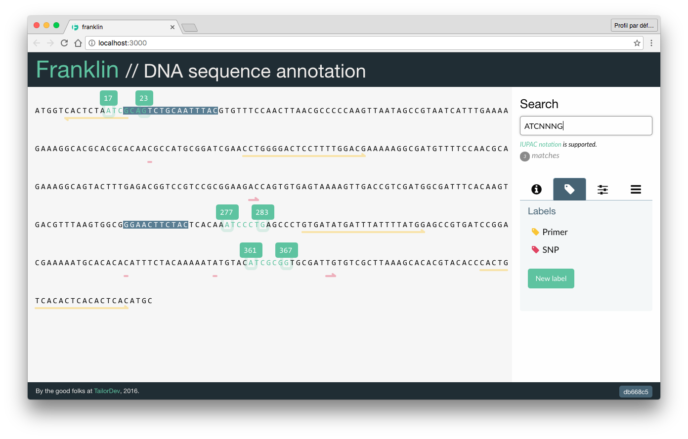

Franklin
========

Franklin is a DNA sequence annotation tool we built at TailorDev in order to
play with SVGs, [React](https://facebook.github.io/react/), and
[Redux](http://redux.js.org/) as part of our "Le lab" sessions:

* https://tailordev.fr/blog/2016/06/09/le-lab-3-franklin-dna-sequence-annotation-tool/
* https://tailordev.fr/blog/2016/07/01/le-lab-4-franklin-dna-ninja/

## Usage

Either install the project or use our public instance:
https://franklin.lelab.tailordev.fr/.

## Installation

### Production

    $ git clone https://github.com/TailorDev/franklin.git
    $ npm install # will run `npm run build`
    $ npm prune --production

We use this
[Dockerfile](https://github.com/TailorDev/dockerfiles/blob/master/node/Dockerfile)
to run franklin in production (which runs `npm run start` from the franklin root
directory).

### Development

    $ git clone https://github.com/TailorDev/franklin.git
    $ npm install
    $ npm run dev

## Requirements

We use `node` 6.2+ and `npm` 3.8+.

## Contributing

Please see the [CONTRIBUTING](CONTRIBUTING.md) file.

## Running the Tests

    $ npm run test

You can also "watch" them:

    $ npm run test:watch

Code coverage is available by running:

    $ npm run cov

## Contributor Code of Conduct

Please note that this project is released with a [Contributor Code of
Conduct](http://contributor-covenant.org/). By participating in this project you
agree to abide by its terms. See the [CODE_OF_CONDUCT](CODE_OF_CONDUCT.md) file.

## Credits

We use [NtSeq](https://github.com/keithwhor/NtSeq) (browser version) from Keith
Horwood, which is versioned (and slightly modified) in `app/utils/ntseq.js`.

## License

Franklin is released under the MIT License. See the bundled
[LICENSE](LICENSE.md) file for details.
